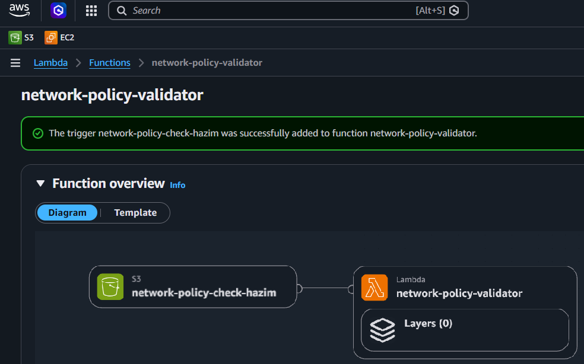
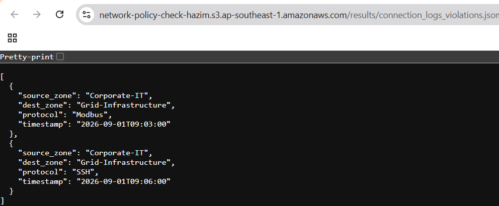
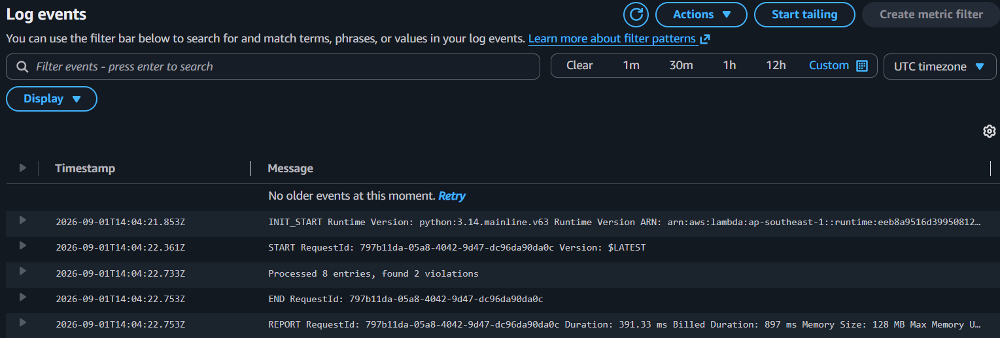
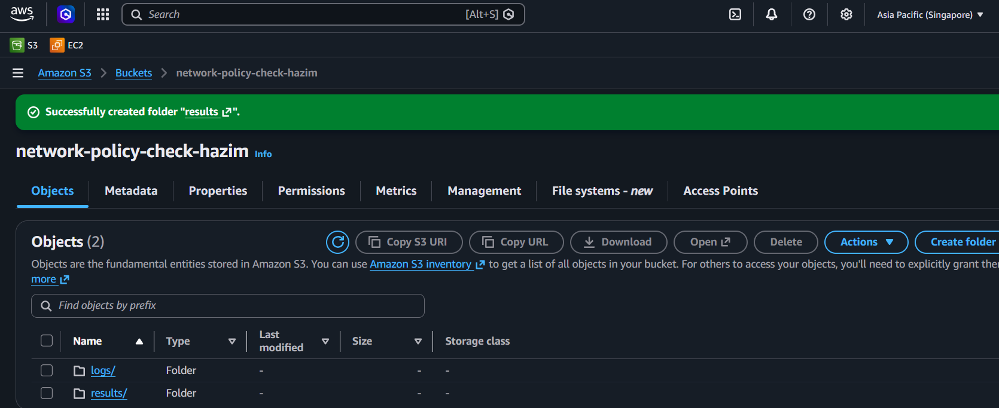
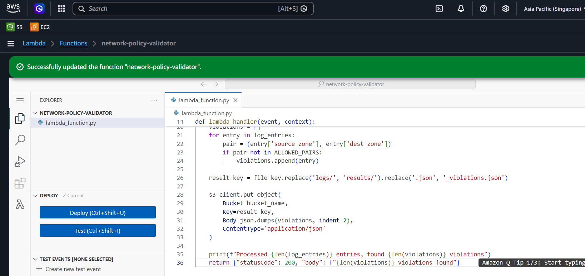
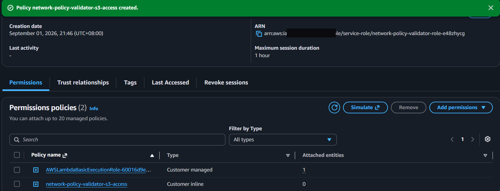
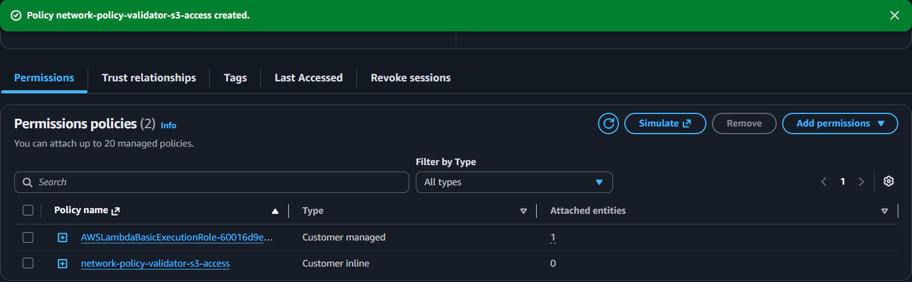
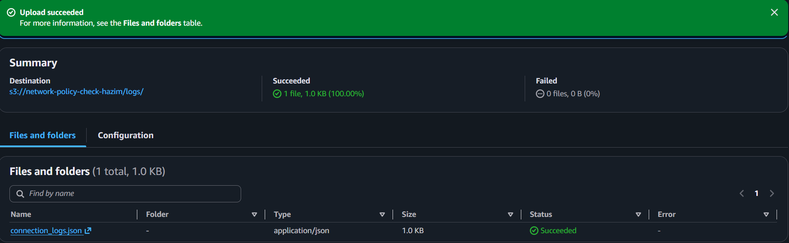

# Cloud-Based Network Access Policy Validator for Energy Infrastructure Segmentation

**A serverless AWS pipeline that caught 2/2 planted network policy violations, 0 false positives, in 391ms.**



**S3 Upload → Lambda Policy Check → Flagged Violations Written to S3**

**Relevant to:** Cloud Security · SOC Analyst · Network Segmentation · AWS (S3, Lambda, IAM, CloudWatch) · Python · Access Control & Least Privilege

**Jump to:** [Executive Summary](#executive-summary) · [Results](#results) · [Full Technical Breakdown](#full-technical-breakdown) · [References](#references)

---

## Executive Summary

**The problem: energy companies keep getting hit through the office network, not the power plant.**

> Colonial Pipeline, 2021. A ransom note appeared on a control room screen. The company couldn't guarantee the ransomware wouldn't spread from IT into the systems that physically control fuel flow, so they shut the whole pipeline down themselves, for six days, and paid $4.4 million to get back online. ([NPR](https://www.npr.org/2021/06/03/1003020300/colonial-pipeline-ceo-explains-the-decision-to-pay-hackers-4-4-million-ransom))
>
> Iberdrola, 2024. One of Europe's largest energy companies, and the parent of Scottish Power, had customer data stolen for over 1.3 million people after attackers got into its systems. Names, ID numbers, phone numbers, addresses. ([Infosecurity Magazine](https://www.infosecurity-magazine.com/news/scottish-power-parent-data-breach/))
>
> Siemens Energy and Schneider Electric, 2023 and 2024. Both confirmed data stolen in separate attacks, Siemens Energy through a vulnerability in a file-transfer tool, Schneider Electric through ransomware that hit its Sustainability division and reportedly took 1.5 terabytes of data. Neither attack touched a turbine or a control system. Both went through ordinary corporate IT. ([BleepingComputer](https://www.bleepingcomputer.com/news/security/siemens-energy-confirms-data-breach-after-moveit-data-theft-attack/), [IT Pro](https://www.itpro.com/security/ransomware/schneider-electric-confirms-data-was-stolen-in-cactus-ransomware-attack))

**What I built: a serverless AWS pipeline that automatically checks connection logs against an access-control policy.**

> An AWS Lambda function, triggered by every upload to S3, checks each connection's source and destination against a list of approved network paths. Anything outside that list gets flagged.

**The impact: caught every planted violation, missed nothing.**

> 8 log entries processed, 2/2 violations correctly flagged, 0 false positives, confirmed in CloudWatch. This uses simulated data and hardcoded rules to demonstrate the pattern, it's not a production system, and I don't have hands-on OT experience.
>
> The business case is the same one Colonial Pipeline learned the expensive way: catching one unauthorized IT-to-grid connection before it reaches control systems is the difference between a blocked packet and a six-day shutdown. Detection this cheap and this fast is worth building even in simplified form.

**Why this is still happening, right now:**

> Eversource Energy, a Massachusetts utility serving three US states, disclosed in 2026 that a phishing attack compromised two employees' credentials and exposed data for thousands of customers. Five different energy companies, five different years, the same root cause: attackers didn't need to touch the grid, they just needed one weak door on the IT side. ([ISSSource](https://www.isssource.com/energy-provider-hit-in-phishing-attack/))

---

## Results

8 connection log entries. 2 planted violations: direct `Corporate-IT → Grid-Infrastructure` connections, bypassing the monitoring gateway. 6 legitimate connections across 4 approved paths.

| Metric | Result |
|---|---|
| Log entries processed | 8 |
| Violations correctly identified | 2 / 2 |
| False positives | 0 |
| Execution duration (CloudWatch) | 391.33 ms |




---

## Full Technical Breakdown

**Tech stack**

| Layer | Tools |
|---|---|
| Storage / trigger | AWS S3 |
| Compute | AWS Lambda (Python 3.12) |
| Access control | AWS IAM (custom scoped inline policy) |
| Verification | Amazon CloudWatch Logs |

**Test data**

No public dataset, this project uses 8 hand-written connection log entries designed to test specific cases, not a downloaded sample. Each entry has a `source_zone`, `dest_zone`, `protocol`, and `timestamp`. 6 entries represent legitimate traffic across 4 approved zone pairs. 2 are deliberately planted violations, direct `Corporate-IT → Grid-Infrastructure` connections that skip the monitoring gateway, using two different protocols (Modbus, SSH) to confirm the check flags the path, not the protocol carrying it.

**The validation logic**

```python
ALLOWED_PAIRS = {
    ("Corporate-IT", "Grid-Monitoring-Gateway"),
    ("Grid-Monitoring-Gateway", "Grid-Infrastructure"),
    ("Remote-VPN", "Grid-Infrastructure"),
    ("Corporate-IT", "Corporate-IT"),
}

for entry in log_entries:
    pair = (entry['source_zone'], entry['dest_zone'])
    if pair not in ALLOWED_PAIRS:
        violations.append(entry)
```

**Design decisions**

**Hardcoded rules, not a database.** A production system would store rules in DynamoDB, editable without redeploying code. I hardcoded them here instead: faster to build, easier to audit, less flexible at runtime. Listed under Limitations, not hidden.

**Violations go to a separate file, not an alert.** Flagged connections land in a distinct `results/` prefix. Nothing gets modified or deleted in place. A false positive costs one extra file, not a blocked connection.

**Least-privilege IAM, not a managed policy.** The Lambda role is limited to `s3:GetObject` on the input prefix and `s3:PutObject` on the output prefix. No `AmazonS3FullAccess`. This replaced the broader default role AWS creates automatically.

```json
{
    "Version": "2012-10-17",
    "Statement": [
        {
            "Sid": "ReadLogsFolder",
            "Effect": "Allow",
            "Action": "s3:GetObject",
            "Resource": "arn:aws:s3:::network-policy-check-hazim/logs/*"
        },
        {
            "Sid": "WriteResultsFolder",
            "Effect": "Allow",
            "Action": "s3:PutObject",
            "Resource": "arn:aws:s3:::network-policy-check-hazim/results/*"
        }
    ]
}
```

**Evidence**

| # | Screenshot | What it shows |
|---|---|---|
| 1 | <a href="evidence/01-s3-bucket-setup.png"></a> | Bucket created, `logs/` and `results/` folders |
| 2 | <a href="evidence/02-lambda-code.png"></a> | Deployed Lambda function code |
| 3 | <a href="evidence/03-iam-policy.png"></a> | Scoped inline IAM policy, attached |
| 4 | <a href="evidence/04-permissions-policies.png"></a> | Final permissions view, both policies attached |
| 5 | <a href="evidence/05-trigger-config.png"></a> | S3 trigger wired to the Lambda function |
| 6 | <a href="evidence/06-test-upload.png"></a> | Test connection log uploaded to `logs/` |
| 7 | <a href="evidence/07-violations-output.png"></a> | Generated violations file, exact match to planted test data |
| 8 | <a href="evidence/08-cloudwatch-logs.png"></a> | Processing count and execution duration, confirmed |

**Challenges**

- AWS defaults to `us-east-1` on bucket creation. Caught it before creating resources in the wrong region, switched to `ap-southeast-1` first.
- The default Lambda execution role only grants basic logging permissions, no S3 access. Had to build the scoped inline IAM policy separately rather than rely on AWS's suggested defaults.
- Console screenshots exposed the AWS account ID in a couple of views (bucket nav bar, IAM role ARN). Redacted before using them as evidence, worth checking for on any cloud-console screenshot before publishing.

**Scaling this further**

At production scale, the fixed rule list would move to DynamoDB so policies update without a redeploy, and the connection zones would come from real network telemetry instead of a hand-written test file. The core logic, checking a path against an approved list, would not need to change.

**Run it**

Requires an AWS account with S3, Lambda, and IAM access.

```bash
git clone https://github.com/aliffhazim/grid-access-policy-validator
# Upload sample-data/connection_logs.json to your bucket's logs/ prefix
# Check results/ for the generated *_violations.json output
```

**Limitations**

- Rules are hardcoded, not stored externally. Faster to build, not runtime-editable.
- Zone and protocol data is simulated, not from a real industrial network. I don't have hands-on OT experience.
- This checks policy on uploaded logs. It doesn't intercept or block traffic in real time.

---

## References

- NPR, "The Colonial Pipeline CEO Explains The Decision To Pay Hackers A $4.4 Million Ransom": https://www.npr.org/2021/06/03/1003020300/colonial-pipeline-ceo-explains-the-decision-to-pay-hackers-4-4-million-ransom
- Infosecurity Magazine, "Scottish Power Parent Company Hit by Data Breach" (Iberdrola): https://www.infosecurity-magazine.com/news/scottish-power-parent-data-breach/
- BleepingComputer, "Siemens Energy confirms data breach after MOVEit data-theft attack": https://www.bleepingcomputer.com/news/security/siemens-energy-confirms-data-breach-after-moveit-data-theft-attack/
- IT Pro, "Schneider Electric confirms data was stolen in Cactus ransomware attack": https://www.itpro.com/security/ransomware/schneider-electric-confirms-data-was-stolen-in-cactus-ransomware-attack
- ISSSource, "Energy Provider Hit in Phishing Attack" (Eversource Energy): https://www.isssource.com/energy-provider-hit-in-phishing-attack/
